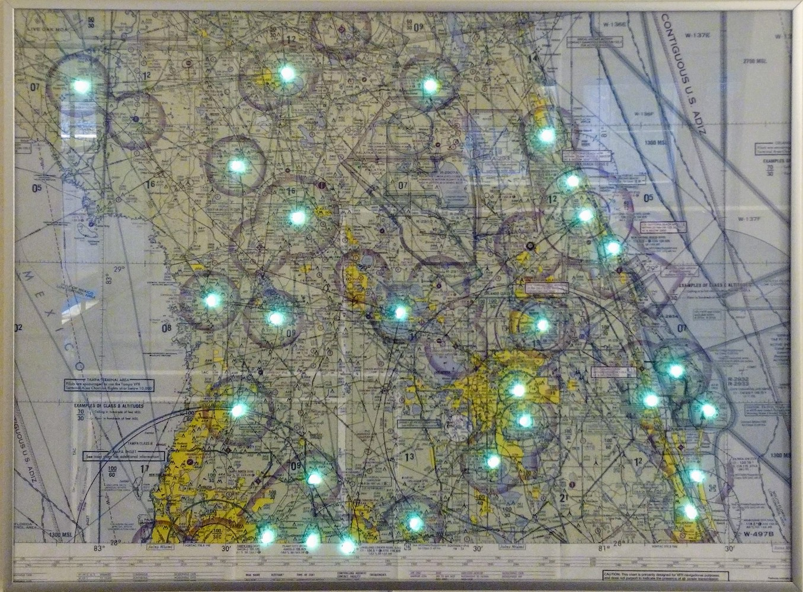

# WxSectional

A high-quality FAA sectional poster showing weather conditions. This repository is a VS Code project that uses PlatformIO to produce code for a ESP8266. Most configuration must be done before compiling.

This was intended as a sectional map, but it can of course be used with any type of map. Other similar maps exist on the internet: [LiveSectional](http://www.livesectional.com/), [LED Sectional Project](https://led-sectional.kyleharmon.com/), and [METARmaps](https://metarmaps.squarespace.com/), to name a few. None of them quite fit my requirements, and I wanted to use a map that I had used for a checkride, so I made my own.

## Features

* Low parts cost
* Configurable WiFi connection without needing to re-flash (using the ESPTouch app)
* Minimum thickness (about 1" total)
* Fast boot time (ready in 5 seconds)
* Proper HTTPS certificate checking (quite a novelty on embedded hardware!)
* Subtle color transitions (fades between colors)
* Auto-brightness and current-limited brightness
* Powered by USB

## User guide

1. Setup
    1. Connect the ESP8266 to a computer with a USB cable.
    1. Download and install Visual Studio Code.
    1. Install the PlatformIO plugin.
    1. Clone and open this repository.
1. Install CA certificates
    1. Run `python3 certs-from-mozilla.py`
    1. Run PIO task `Upload File System image`
1. Configure project your sectional.
1. Upload PIO project.
1. Setup WiFi
    1. Install "ESPTouch" on Android or iOS device.
    1. Ensure you're connected to a 2.4GHz network on the device.
    1. Use ESPTouch to configure the ESP8266 to the specific network.

## Parts list

This is what I used. However, what I am providing is the software. You can use whatever materials you like.

* ESP-12E development board - $14 for 3
* Map - $10
* [20x30in frame](https://www.amazon.com/dp/B072HJM2Y5/) - $35
* Black foam-core board - $3
* Spray adhesive (3M Super 77 recommended) - $10
* Photoresistor ([GM5539](https://www.amazon.com/dp/B01N7V536K/) recommended) - $5 for 30
* [WS2812 LED strip](https://www.amazon.com/dp/B01DC0ITX4/) - $18
* Assorted wires
* Hot glue
* USB [cable](https://www.amazon.com/dp/B012VZT5IO/) and [wall adapter](https://www.amazon.com/dp/B07DFWKBF7/) - $14
* Rubber feet - $???

All-in, approximate unit cost for the JAX sectional is about $90 as of April 2020. Depending on the map, a second set of LEDs may be required.

## Assembly guide

It took me several hours to assemble the whole map, plus many more to write the software.

1. Select a map. I used the JAX sectional.
1. Apply spray adhesive to foam-core board and affix map, avoiding wrinkles.
1. Locate airports on the map that report weather. Poke holes through the map at those airports. I used a #2 Philips screwdriver with a round shaft. [A specialized tool](https://www.amazon.com/dp/B007L6EUJ8/) would produce much nicer holes.
1. Cut the map down to the right size for the frame.
1. Glue the LEDs to the back of the foam-core board. Carefully pick the path to reduce the number of LEDs used. 
1. Glue the ESP8266 to the foam-core board, as close to center horizontally as possible. This lets the cable fall straight down and doesn't let the weight of the cable pull the frame.

## Future work

If this project becomes popular enough, I'll make a start-to-finish tutorial with pictures.

Some maps have a lot of stations that report weather, and that could exceed the RX buffer size. Break the station list into chunks of 25 or so to ease the load on both the server and client.

Lots of people don't like it when their stuff starts blinking red. Add a tiny OLED or e-ink screen to show diagnostics and status.

## FAQs

### Everything is blinking red!

In the immortal words of Douglas Adams, **Don't panic!™** Also, this isn't a question.

The red-blinking-lights display is a generic "error" indicator. Try the following checklist:

1. Verify the WiFi still works and can access the internet.
1. Reconnect the device to WiFi using ESPTouch.
1. Reboot the device.
1. Regenerate and upload the CA file in case the relevant CA changed its key.
1. Connect the device to a computer and check the serial port for messages.

### Can you make one for me? I'll pay you.

Sure! Let's chat and work out a price. Figure on $150 to $300, depending on complexity and customization.

## License

This code is released under the GPLv3 license, except where noted. You may use this repository and guide to make your own map or to sell maps, but you may not make modifications to this software without releasing it under the same license. Attribution would be nice, and I'd really enjoy hearing if this helped someone.
